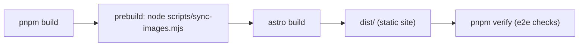
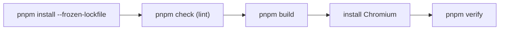

The platform is built with Astro in **static output mode** and publishes
`dist/` to GitHub Pages. This page documents the configuration and the
environment variables that control it.

## The configuration

`astro.config.mjs` (root):

```js
export default defineConfig({
  site: process.env.SITE_URL || "https://yousef-diab.github.io",
  base: process.env.BASE_PATH ?? "/the-algorithm",
  output: "static",
  integrations: [react()],
  vite: { plugins: [tailwindcss()] },
});
```

- **`site`** — the canonical site URL. Defaults to the GitHub Pages URL;
  overridable at build time with `SITE_URL`.
- **`base`** — the base path of the site. Defaults to `/the-algorithm`
  (the GitHub Pages project path). Overridable with `BASE_PATH`.
- **`output: "static"`** — the site is pre-rendered to plain HTML; no server,
  no runtime requests.
- **`integrations: [react()]`** — enables the React islands.
- **Tailwind CSS 4** is wired through the Vite plugin (not the PostCSS
  plugin), configured in `src/styles/global.css` along with DaisyUI 5 themes.

### Base path semantics

```text
BASE_PATH unset   → base = "/the-algorithm"   (GitHub Pages project site)
BASE_PATH=""      → base = "/"                (root-level hosts like Coolify)
BASE_PATH="/docs" → base = "/docs"            (sub-path deployments)
```

The `u()` helper in `src/lib/course.ts` prefixes all internal links with the
resolved base, so the same build works at any base path. **Never hard-code
`/the-algorithm` in links or assets** — always use `u()`.

## Build steps



1. `prebuild` runs `scripts/sync-images.mjs`, mirroring `images/` into
   `public/images/` (so charts are included in the build).
2. `astro build` walks `content/` via the custom loaders, validates with Zod,
   renders all pages, and writes `dist/`.
3. `pnpm verify` then runs the headless end-to-end checks against `dist/`.

`dist/` is **build output** — git-ignored, never hand-edited. Any manual
change is overwritten on the next build.

## Deployment

### GitHub Pages

`.github/workflows/deploy.yml` publishes `dist/` to GitHub Pages via
`withastro/action@v6`. The `site` + `base` live in `astro.config.mjs` and are
overridable via `SITE_URL` / `BASE_PATH`.

The workflow runs on pushes to `main` (and on demand). **Never commit or push
from `main` yourself** unless explicitly asked — the repository publishes
directly from `main`.

### Coolify (or any root-level host)

The site can be deployed as a **static build with `dist/` as the output**
directory. Set `BASE_PATH=""` (or `BASE_PATH=/`) at build time so the site is
served from the domain root:

```bash
BASE_PATH=/ pnpm build
```

The same `dist/` output works everywhere because all internal links go through
`u()`.

## CI

`.github/workflows/ci.yml` runs on every PR and push to `main`:



See [CI/CD](/development/ci-cd) for details.

## The docs project

The `docs/` workspace package has its own Astro config
(`docs/astro.config.mjs`) with the Starlight + Mermaid integrations. It builds
into `docs/dist/` and is a completely separate project. Its config, scripts
and ports are documented in [Local Setup](/getting-started/local-setup).
