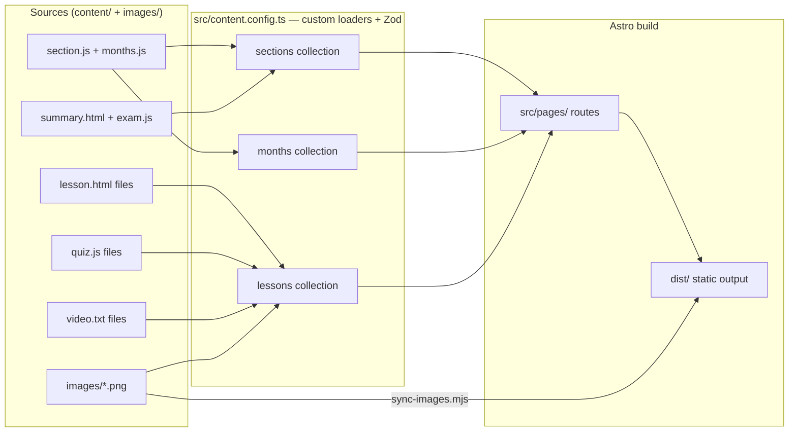

The platform has **no content migration step**: content stays in the same
`content/` + `images/` folders, and **custom Astro loaders** walk the folder
tree at build time to produce the content collections. Everything is derived —
you never register a lesson, a quiz, a chart count or a video link anywhere.

## Pipeline overview



## The loaders

`src/content.config.ts` defines the `sections`, `months` and `lessons`
collections:

```ts
import { defineCollection } from "astro:content";
// ... custom loaders that walk content/ ...
export const collections = {
  sections: defineCollection({ loader: sectionsLoader(), schema: sectionSchema }),
  months:   defineCollection({ loader: monthsLoader(),   schema: monthSchema }),
  lessons:  defineCollection({ loader: lessonsLoader(),  schema: lessonSchema }),
};
```

Each loader:

1. **Walks the folder tree** — sections → months → lesson folders.
2. **Reads the convention-named files** (`lesson.html`, `quiz.js`,
   `video.txt`, `section.js`, `months.js`, `summary.html`, `exam.js`).
3. **Parses the formatter-tolerant literals** (bare `{…}` objects and array
   literals with optional trailing semicolons).
4. **Validates** the result against the Zod schema.
5. **Exposes** the entry to the page components via `getCollection()` /
   `getEntry()` from `astro:content`.

Because the loaders are the single point of truth for how files become data,
the format-tolerant parsing ("defense is in the build") lives here: if a
formatter ever inserts `;` into a `section.js`/`months.js` block literal or
appends a trailing `;` to a quiz/exam array, the loader still reads it
correctly.

## Images are auto-derived

Chart counts are **auto-derived** by counting `images/{slug}-NN.png` for each
fig-slot slug:

```text
images/
  m4-03-orderblocks-01.png
  m4-03-orderblocks-02.png
  m4-03-orderblocks-03.png
```

- The lesson's `data-slug="m4-03-orderblocks"` determines the prefix.
- `NN` is zero-padded from `01`.
- There is **no image-count table to maintain** — drop the PNGs in, rebuild,
  done.
- A **missing image auto-removes its figure** at runtime, and **galleries**
  render when a lesson has more than 2 charts.

## The sync step

`scripts/sync-images.mjs` mirrors `images/` into `public/images/` before every
build/dev run (it is wired as `prebuild` and `predev`). `public/` is copied
verbatim into `dist/`, so the chart PNGs end up at
`dist/images/{slug}-NN.png`.

:::note
`public/images/` is git-ignored — it is a generated mirror, never committed.
The canonical chart files live in `images/`.
:::

## What the pipeline produces

The three collections drive every page:

- `sections` → landing cards, sidebar grouping, section routes.
- `months` → sidebar group headings (`Month 1 — …` / `Part 1 — …`).
- `lessons` → lesson pages, prev/next navigation, quiz data, video links,
  figure counts, progress totals, exam/review pages.

Because everything is derived from the tree, **adding a new lesson/month/
section needs zero registration** — see [Add a Lesson](/content/add-lesson),
[Add a Month](/content/add-month) and [Add a Section](/content/add-section).
