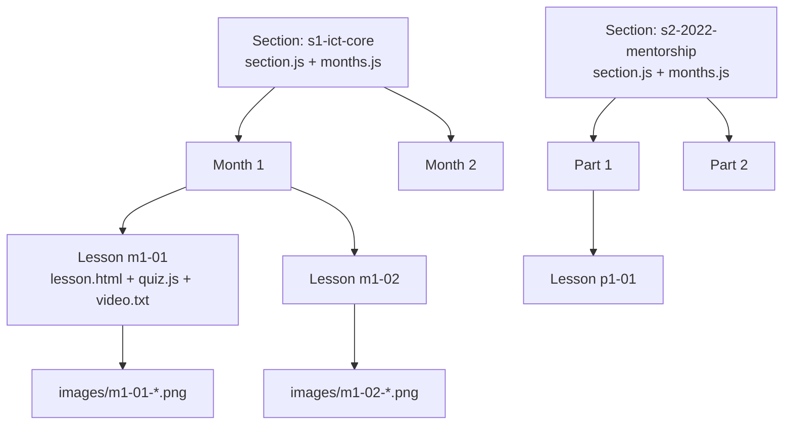

The course data model is a strict **section → month → lesson** hierarchy. It is
defined by conventions (folder names, file names, id formats) plus Zod
validation in `src/content.config.ts`, and it is read at build time by custom
Astro loaders that walk the `content/` tree.

## The hierarchy



## Sections

A section is a folder `content/<section-id>/` containing:

| File | Purpose | Required? |
| --- | --- | --- |
| `section.js` | The section's meta: `{id, short, title, desc, label?}` | Yes |
| `months.js` | One `{id, title, desc}` per month, **no wrapping array** | Yes |
| `summary.html` | The section's revision summary page | Optional |
| `exam.js` | The section's final-exam array literal | Optional |
| `m1/`, `m2/`, … | One folder per month (in Section 2: `p1/`…`p6/`) | Yes |

Example `section.js`:

```js
{
  id: "s1-ict-core",
  short: "ICT Core",
  title: "ICT Core (Months 1–4)",
  desc: "The foundational ICT concepts, month by month.",
  label: "Month"
}
```

- `label` is optional — `"Month"` by default, `"Part"` for the 2022 Mentorship.
  It drives the sidebar group heading and the numbering wording.
- `section.js` is **required** if `summary.html` or `exam.js` exists.

## Months

`months.js` holds **one bare `{…}` object literal per line** — there is no
wrapping array:

```js
{ id: "m1", title: "Month 1 — Reading The Conditions", desc: "…" }
{ id: "m2", title: "Month 2 — …", desc: "…" }
```

Titles use an **em-dash**: the part before `—` is the sidebar group heading,
the part after is the descriptive title.

## Lessons

A lesson is a folder `content/<section>/<month>/<id>/` containing exactly
three files:

| File | Purpose |
| --- | --- |
| `lesson.html` | The `<section class="lesson">` markup, verbatim |
| `quiz.js` | This lesson's quiz array literal |
| `video.txt` | The source video URL (one line; empty = no link) |

### Lesson ids

- Lesson `id` = `m{month}-{NN}` (zero-padded, e.g. `m4-03`).
- The folder name **must equal** the `id=` in `lesson.html`, and `data-quiz`
  must match too.
- `data-month` carries the parent month id (`m4`).

### Slugs

- Slug = `m{month}-{NN}-{kebab-title}` (e.g. `m4-03-orderblocks`), used only in
  `data-slug` for charts.
- Keep slug and id prefixes in sync — the loaders key off the first
  5 characters (`m4-03`).

## Meta files are formatter-proof — keep them that way

`section.js` and `months.js` hold **bare `{…}` object literals** (one per line,
no wrapping array), which a JS formatter reads as *block statements* and
"fixes" by inserting a `;` before the `}`. Array files (`quiz.js`, `exam.js`)
get a trailing `;`. **Both are tolerated by the loaders** in
`src/content.config.ts` — defense is in the build.

So:

- **Reformat these files freely** — stray semicolons are tolerated.
- **If you change their *shape*** (e.g. a nested object, or a `}` inside a
  string), re-check the loaders in `src/content.config.ts`.

## Zod validation

`src/content.config.ts` defines the `sections`, `months` and `lessons`
collections with Zod schemas. At build time each entry is validated against
its schema, so a malformed meta file or a lesson folder with missing pieces
fails the build with a clear error instead of silently breaking the site.

See [Content Pipeline](/architecture/content-pipeline) for how the loaders
read these files, and [Content Authoring](/content/add-lesson) for tutorials.
