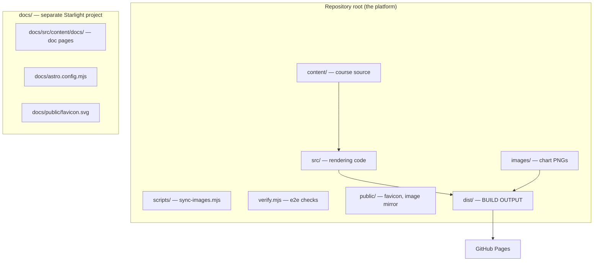

The repository is a **pnpm workspace** containing two packages: the platform
(the root) and the documentation site (`docs`). The platform itself follows a
clean separation between **rendering code** (`src/`), **course content**
(`content/`), and **chart images** (`images/`).

## Workspace layout



## Full tree

```text
src/
  pages/                     ← routes (landing, /course, lessons, review, exam, 404)
  layouts/                   ← BaseLayout (head, theme, favicon) + CourseLayout (header, sidebar, lightbox)
  components/                ← .astro components + React islands (.tsx)
    Header.astro             ← topbar (brand + theme switcher)
    ThemeToggle.tsx          ← light / dark / system (client:load)
    Sidebar.tsx              ← course nav + progress (client:idle)
    Quiz.tsx                 ← lesson check (client:visible)
    Exam.tsx                 ← section final exam (client:visible)
    Notes.tsx                ← per-lesson local notes (client:idle)
    LessonFooter.tsx         ← prev / mark complete / next (client:idle)
    ResetPanel.tsx           ← reset controls on /course (client:visible)
    CourseProgress.tsx       ← patches done-counts on /course (client:idle)
    Lightbox.tsx             ← chart lightbox, zoom + pan (client:idle)
    Figure.astro             ← server-side chart figures from fig-slots
    SiteFooter.astro
  lib/
    course.ts                ← types + u() base-URL helper
    graph.ts                 ← getGraph() nested sections→months→lessons
  stores/
    progress.ts              ← nanostores: doneStore + examStore (localStorage)
  styles/
    global.css               ← Tailwind 4 + DaisyUI 5 themes + component CSS
  content.config.ts          ← custom loaders + Zod schemas (walks content/)
content/                     ← course source (same layout as before)
  s1-ict-core/               ← Section 1 (ICT Core, Months 1–4)
  s2-2022-mentorship/        ← Section 2 (2022 Mentorship, Parts 1–6)
    section.js               ← this section's meta ({id, short, title, desc, label?})
    months.js                ← the MONTHS entries for this section
    summary.html             ← the section's revision summary page (optional)
    exam.js                  ← the section's final-exam array literal (optional)
    m1/ m2/ m3/ m4/          ← months (p1…p6 in Section 2)
      m1-01/                 ← one folder per lesson (= lesson id)
        lesson.html          ← the <section class="lesson"> markup, verbatim
        quiz.js              ← this lesson's quiz array literal
        video.txt            ← the source video URL (one line; empty = no link)
images/                      ← {slug}-NN.png chart files (counts auto-derived)
scripts/
  sync-images.mjs            ← copies images/ → public/images (predev/prebuild)
verify.mjs                   ← headless end-to-end checks (Node + Playwright)
public/                      ← copied verbatim to dist (favicon, images mirror)
dist/                        ← BUILD OUTPUT (gitignored, served by GitHub Pages)
transcripts/                 ← source transcripts (git-ignored, local only)
notes/                       ← source notes + charts (git-ignored, local only)
docs/                        ← the Starlight documentation project (this site)
```

## What each top-level area is for

### `src/` — rendering code

Everything that turns content into HTML/JS. Pages define routes; layouts wrap
pages in shared chrome; components render pieces of UI. `.astro` files render
on the server (and ship zero JS unless they mount a React island); `.tsx`
files are interactive islands that get hydrated on the client with a
`client:` directive.

### `content/` — course source

The course itself. One folder per lesson, named after the lesson id
(`m1-01`). The build walks this tree — you never register a lesson anywhere.

### `images/` — chart images

PNG files named `{slug}-NN.png` (zero-padded, from `01`). Chart counts are
**auto-derived** by counting files for each `data-slug`; `sync-images.mjs`
mirrors the folder into `public/images/` before every build/dev run. There is
no image-count table to maintain.

### `transcripts/` and `notes/` — source material

The primary sources for content (Section 1 and 2 transcripts + ICT's notes).
**Git-ignored, local only** — never commit these. See
[Content Rules](/content/rules).

### Legacy files — do not touch

`build.py`, `verify.py`, `engine/` and the old `index.html` are **obsolete** —
they belong to the previous single-file Python build and are left in place for
reference only. Never edit them, never run them, and do not hand-edit
`index.html` (it is stale and will not be updated).

### `docs/` — the documentation project

A completely separate Astro Starlight project. It is a workspace package
(`docs/package.json`) with its own `astro.config.mjs`, `tsconfig.json`,
content config and `src/content/docs/` pages. It does not share any source
files with the platform and cannot interfere with it. See
[Local Setup](/getting-started/local-setup) for how to run it.

:::note
The three legacy markdown files at the root of `docs/`
(`content-audit.md`, `s2-2022-mentorship-plan.md`, `s2-2022-mentorship-videos.md`)
are project plans and audits — they are **not** Starlight pages (Starlight
only reads `docs/src/content/docs/`). They stay in place; see
[Legacy Project Docs](/reference/legacy-docs).
:::
