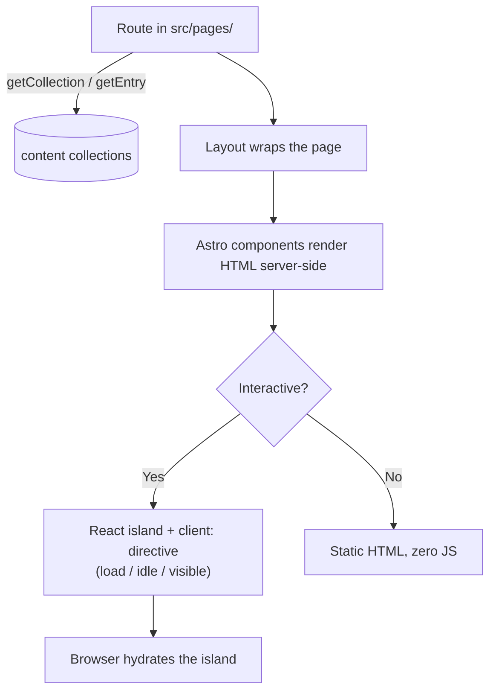

Rendering is **data-driven**: routes in `src/pages/` fetch content from the
collections and render it, layouts provide shared chrome, and React islands
provide interactivity with selective hydration. This page explains the flow
from request to HTML.

## Rendering flow



## Routes

| Route | Page file | Renders |
| --- | --- | --- |
| `/` | `src/pages/index.astro` | Landing page with section cards |
| `/course` | `src/pages/course/index.astro` | Course page: all sections/months/lessons + reset controls |
| `/course/[section]/[month]/[lesson]` | `src/pages/course/[...]/[...]/[...].astro` | One lesson page |
| `/course/[section]/review` | `src/pages/course/[section]/review.astro` | The section's revision summary |
| `/course/[section]/exam` | `src/pages/course/[section]/exam.astro` | The section's final exam (generated from `exam.js`) |
| `/404` | `src/pages/404.astro` | Not-found page |

## Layouts

- **`BaseLayout.astro`** — the HTML head, meta tags, theme setup, favicon
  (the brand mark: gold `A` on navy), and global styles.
- **`CourseLayout.astro`** — the course chrome: `Header`, `Sidebar`, the
  lightbox, and the main content area. Lesson pages use this.

## The lesson slot contract

A lesson page is driven by the lesson's `lesson.html`, which must keep these
slots **exactly** (the build fills them):

```html
<section class="lesson" id="m4-03" data-title="Orderblocks" data-month="m4">
  <div class="lesson-hero">
    <div class="crumb">Month 4 · Lesson 3</div>
    <h2>Orderblocks</h2>
    <div class="desc">One-line summary.</div>
  </div>

  <!-- body: <h3>, <ul>/<ol>, .callout / .callout.rule / .callout.warn
       (each with <span class="tag">Label</span>), .kv rows, .flip-row + .flip cards -->

  <div class="fig-slot" data-slug="m4-03-orderblocks"></div>
  <div class="quiz" data-quiz="m4-03"></div>
  <div class="lesson-footer"></div>
</section>
```

| Slot | Filled with |
| --- | --- |
| `.lesson-hero` | Crumb, title, description |
| `.fig-slot` | Chart figures from `images/{slug}-NN.png` (via `Figure.astro`) |
| `.quiz` | The lesson's quiz (React `Quiz` island, `client:visible`) |
| `.lesson-footer` | Prev / mark complete / next (React `LessonFooter`, `client:idle`) |

## Hydration strategy

Interactive components are **React islands** — the server renders their HTML,
and a `client:` directive decides when the browser hydrates them:

| Directive | Used by | Why |
| --- | --- | --- |
| `client:load` | `ThemeToggle` | Must work immediately; tiny. |
| `client:idle` | `Sidebar`, `Notes`, `LessonFooter`, `CourseProgress`, `Lightbox` | Non-critical, hydrate when the browser is idle. |
| `client:visible` | `Quiz`, `Exam`, `ResetPanel` | Only hydrate when scrolled into view — saves work on long pages. |

Everything else renders as **static HTML with zero JavaScript**.

## The base-URL helper

`src/lib/course.ts` exports the `u()` helper, which prefixes paths with the
configured base path (`/the-algorithm` by default, or `/` when
`BASE_PATH=/`). **Always route through `u()`** for internal links so the site
works at any base path. See [Build System](/architecture/build-system).

## The course graph

`src/lib/graph.ts` exports `getGraph()` — the nested
`sections → months → lessons` structure used by the sidebar, the course page,
and the prev/next navigation. It is derived from the collections, so new
content appears in navigation automatically.

## Review & exam pages

`summary.html` is authored like a lesson but with `id="{sid}-review"`,
`data-kind="review"`, and a `<div class="review-footer"></div>` slot instead
of `.lesson-footer`. The exam page (`exam.astro`) is generated entirely from
`exam.js` — no `exam.html` to write.

Review/exam pages carry `data-kind` and are **excluded** from `LESSONS`, the
lesson count, the progress bar and the notes boxes. See
[Exams & Summaries](/content/exams).
