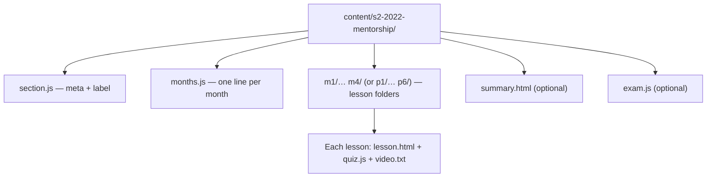

Sections are first-class: they drive the landing cards, the sidebar grouping,
the home cards and the review pages. Adding a new section is the same pattern
as the existing ones — a new `content/<sN-name>/` folder.



## Step 1 — Create the section folder

```text
content/s2-2022-mentorship/
```

## Step 2 — Write `section.js`

One bare object literal:

```js
{
  id: "s2-2022-mentorship",
  short: "2022 Mentorship",
  title: "2022 Mentorship (Parts 1–6)",
  desc: "The ICT 2022 Mentorship, part by part.",
  label: "Part"
}
```

| Field | Meaning | Default |
| --- | --- | --- |
| `id` | Section id; equals the folder name | — |
| `short` | Short name used in compact places | — |
| `title` | Full title | — |
| `desc` | One-line description | — |
| `label` | Noun for grouping: `"Month"` or `"Part"` | `"Month"` |

The `label` drives the sidebar group heading and the numbering wording
("Part 1 · Lesson 2" vs "Month 1 · Lesson 2").

## Step 3 — Write `months.js`

One bare `{id, title, desc}` per line, no wrapping array, em-dash titles:

```js
{ id: "p1", title: "Part 1 — Understanding the Model", desc: "…" }
{ id: "p2", title: "Part 2 — …", desc: "…" }
```

See [Add a Month](/content/add-month) for the em-dash rule.

## Step 4 — Add months and lessons

Each month gets a folder with its lesson folders:

```text
content/s2-2022-mentorship/
  p1/
    p1-01/
      lesson.html
      quiz.js
      video.txt
    p1-02/ …
  p2/ …
```

Each lesson follows [Add a Lesson](/content/add-lesson).

## Step 5 — Add the review page and exam (optional)

Both are optional and independent per section:

- **`summary.html`** — authored like a lesson but with `id="{sid}-review"`,
  `data-kind="review"`, and a `<div class="review-footer"></div>` slot instead
  of `.lesson-footer`. It **re-states the existing lessons**; it never adds
  new material.
- **`exam.js`** — final-exam questions, same shape and authoring rules as
  `quiz.js`. The exam **page** is generated by the route
  `src/pages/course/[section]/exam.astro` — there is no `exam.html` to write.

:::note
`section.js` is **required** if `summary.html` or `exam.js` exists.
:::

## Step 6 — Build and verify

```bash
pnpm build
pnpm verify
```

The new section appears automatically in the landing cards, the sidebar, the
course page, and (if present) its review/exam pages.

## Step 7 — Document and commit

- `CHANGELOG.md`: `### Added` — the new section.
- `README.md`: **update it** — new sections always merit a mention (credits,
  structure).
- Docs site: update [Project Structure](/architecture/project-structure),
  [Data Model](/architecture/data-model) and any affected pages.
- Commit on a feature branch, content together with rebuilt pages.

## Checklist

- [ ] `content/<sN-name>/` with `section.js` + `months.js`.
- [ ] `section.js` id equals the folder name; `label` correct.
- [ ] `months.js` one line per month, em-dash titles.
- [ ] Month + lesson folders complete (`lesson.html`, `quiz.js`, `video.txt`).
- [ ] Review/exam files (if any) follow their rules; `section.js` present.
- [ ] `pnpm build` and `pnpm verify` pass.
- [ ] CHANGELOG / README / docs updated.
