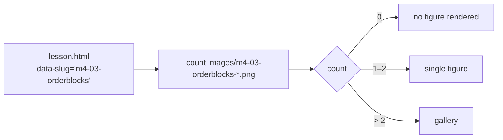

Chart figures are rendered from PNG files in `images/`. Everything is
**auto-derived** — you drop the files in and rebuild; there is no count table
and nothing else to edit.

## Naming

Chart files are named after the lesson's fig-slot slug, with a zero-padded
index from `01`:

```text
images/{slug}-NN.png
```

For a lesson with `data-slug="m4-03-orderblocks"`:

```text
images/m4-03-orderblocks-01.png
images/m4-03-orderblocks-02.png
images/m4-03-orderblocks-03.png
```

## How counts are derived

The loader counts `images/{slug}-NN.png` for each fig-slot slug in the lesson
HTML:



| Count | Behavior |
| --- | --- |
| 0 | The figure is auto-removed at runtime — no broken figure. |
| 1–2 | A regular figure. |
| > 2 | A **gallery** renders. |

## The sync step

`scripts/sync-images.mjs` mirrors `images/` into `public/images/` before every
build/dev run (wired as `prebuild` and `predev`). `public/` is copied verbatim
into `dist/`, so charts end up at `dist/images/{slug}-NN.png`.

:::note
`public/images/` is git-ignored — it is a generated mirror. The canonical
files live in `images/` and are committed there.
:::

## The figure component

`src/components/Figure.astro` is a server-side component: it renders the
figure markup for each `{slug}-NN.png` in the lesson's fig-slot. Each figure
is a `.fig img` clickable in the lightbox.

## The lightbox

Clicking a `.fig img` opens the **whole lesson's** chart set in the lightbox
(`Lightbox.tsx`), so prev/next browses the lesson's charts without closing.
The lightbox supports zoom (relative to fit, max 500%) and drag-to-pan, plus
keyboard shortcuts (`Esc` close, `←`/`→` browse, `+`/`−` zoom, `0` reset).
See [Lightbox](/components/lightbox) for the full behavior contract.

## Adding charts to a lesson

1. Prepare PNG chart images (from ICT's notes — the local copies in `notes/`
   are the permanent ones; Notion URLs expire).
2. Name them `images/{slug}-NN.png`, continuing the sequence.
3. Rebuild + verify:

```bash
pnpm build
pnpm verify
```

`verify.mjs` checks that **every chart image resolves** (no broken figures).

## Troubleshooting

| Symptom | Likely cause |
| --- | --- |
| Figure missing after adding PNGs | The file name doesn't match `{slug}-NN` exactly (check the slug prefix — 5-char id + kebab title). |
| Stale charts in dev | `sync-images.mjs` didn't run (you used `pnpm astro dev` directly) — run `node scripts/sync-images.mjs`. |
| Broken figure in verify | A referenced image file is missing from `images/`. |
