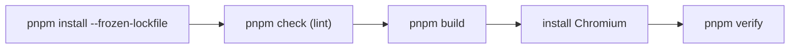

The repository uses GitHub Actions for continuous integration and deployment.
Two workflows live in `.github/workflows/`.

## CI — `.github/workflows/ci.yml`

Runs on **every PR and push to `main`**:

| Step | What it validates |
| --- | --- |
| `pnpm install --frozen-lockfile` | The committed `pnpm-lock.yaml` is in sync with the manifests — **the lockfile must be committed whenever dependencies change**. |
| `pnpm check` | Lint + format (Ultracite + Biome). |
| `pnpm build` | The platform builds cleanly (loaders + Zod validation included). |
| `install Chromium` | Playwright browser for the next step. |
| `pnpm verify` | The full headless end-to-end suite against `dist/`. |

CI fails if any step fails — so always run `pnpm check`, `pnpm build` and
`pnpm verify` locally before pushing.

## Deploy — `.github/workflows/deploy.yml`

Publishes `dist/` to **GitHub Pages** via `withastro/action@v6`.

- Runs on pushes to `main` (and on demand).
- The `site` + `base` live in `astro.config.mjs` — paths are
  `/the-algorithm` — and are overridable at build time via `SITE_URL` /
  `BASE_PATH`.

:::danger
**Never commit or push from `main` yourself** unless explicitly asked — this
repository publishes directly from `main`.
:::

## Notes for contributors

- **Lockfile discipline**: any `package.json` change (root or `docs`)
  requires the regenerated `pnpm-lock.yaml` in the same commit — otherwise CI
  fails on the frozen-lockfile install.
- **Branch flow**: work on feature branches; `main` is the publish path.
- **Local == CI**: `pnpm check` + `pnpm build` + `pnpm verify` locally is
  exactly the CI gate.
