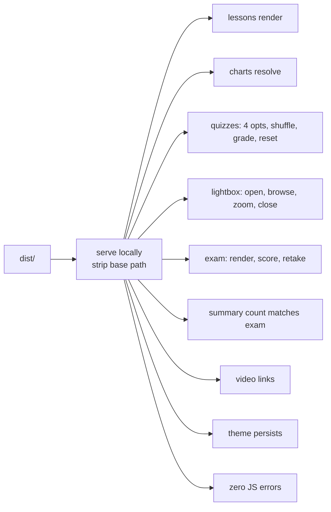

`verify.mjs` (Node + Playwright) is the headless end-to-end suite. It serves
the built `dist/` locally (stripping the `/the-algorithm` base path) and
checks the whole site against expectations **derived from `content/`** —
nothing hard-coded.

## How to run it

```bash
pnpm build     # first — verify runs against the existing dist/
pnpm verify
```

One-time setup: `pnpm install` then `pnpm exec playwright install chromium`.

It exits non-zero and lists the problems on any failure.

## What it checks

- **Every `content/` lesson renders.**
- **Every chart image resolves** — no broken figures.
- **Every quiz renders 4 options**, shuffles, grades, and exposes a reset
  control that actually clears the graded state.
- **The lightbox** opens, browses the lesson's charts, zooms, and closes on an
  outside click but **not** on a click on the image.
- **Review + exam pages render**, and the exam **scores on submit** (full
  answers → 100% pass) with a **working retake**.
- The **question count each `summary.html` states in prose matches the exam
  that actually renders** (a summary may state no count; it may not state a
  wrong one).
- **A video link renders for each lesson with a non-empty `video.txt`.**
- The **theme switcher persists**.
- **Zero console/page JS errors.**



## Why expectations come from content

The suite derives its expected counts and ids from `content/` itself. This
means:

- Adding a lesson automatically adds a render check for it.
- Adding charts automatically adds a resolve check.
- No test fixture needs updating when content grows.

## When to update verify.mjs

Update `verify.mjs` if you add a **new content type or slot** (e.g. a new kind
of page, a new interactive element, a new storage behavior). Follow the
existing patterns: derive expectations from `content/`, drive the browser with
Playwright, and assert the user-visible behavior.

:::caution
Keep the lightbox close-on-outside-click check on **real mouse input**, never
`el.click()` — synthetic clicks bypass Chromium's pointer-capture retargeting
and hide the mid-drag-close bug. See [Lightbox](/components/lightbox).
:::

## CI

CI runs `pnpm install --frozen-lockfile` → `pnpm check` → `pnpm build` →
install Chromium → `pnpm verify` on every PR and push to `main`. If verify
fails locally, it will fail in CI — always run it before finishing a task.
