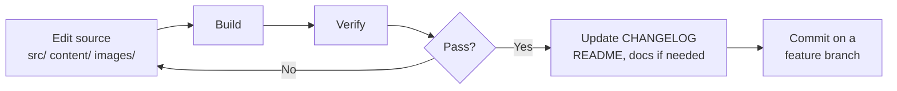

Every change to the platform follows the same loop: **edit source → build →
verify → document**. This page is the operating manual for that loop.

## The one rule that overrides everything

**Course content must come *purely* from the provided source material** —
ICT's mentorship notes and the video transcripts in `transcripts/` for
whichever section is being built. Do **not** add general/outside trading
knowledge, invent examples, or "improve" concepts with information that is not
in the source.

- When enriching a lesson, read the relevant transcript first, then write only
  what it supports.
- Quiz questions and answer explanations must be traceable to the
  notes/transcript, not to outside knowledge.
- If the source is ambiguous, prefer **under-claiming over inventing**. Flag
  the gap rather than filling it.

If a request seems to need outside knowledge, say so instead of quietly adding
it. See [Content Rules](/content/rules).

## The edit → build → verify loop



### 1. Edit source files only

- The published site is a **static Astro build** in `dist/`, produced by
  `pnpm build` from `src/` + `content/` + `images/`.
- **Never hand-edit anything under `dist/`** — it is build output; any manual
  change is overwritten on the next build.
- Edit source files only: lesson HTML, quiz arrays, `video.txt`, chart PNGs,
  components, styles, config.

### 2. Build

```bash
pnpm build
```

This runs `scripts/sync-images.mjs` (mirrors `images/` → `public/images/`)
and then the Astro build, producing `dist/`.

### 3. Verify

```bash
pnpm verify
```

Runs headless end-to-end checks against the built `dist/`. It exits non-zero
and lists the problems on any failure. CI fails if the build or verification
breaks, so **always rebuild and verify before finishing a task**.

## Keep the changelog updated

Create or update `CHANGELOG.md` **before** reporting a task as done:

- Group entries under `## Unreleased` using the headings `### Added`,
  `### Changed`, `### Fixed`, `### Documentation`, `### Verification`.
- Write human sentences ("Added …", "Fixed …"), not commit logs.
- Never fabricate version numbers or release history — document only what
  actually changed.

## Keep the README updated

Before committing significant changes (new features, major fixes, structural
changes, new sections/months/parts, new documentation files), review
`README.md` and update it if the changes merit a mention.

- Skip for trivial edits (a typo fix, a one-line CSS tweak, a quiz-option
  rephrase).
- When in doubt, ask: would someone reading the README benefit from knowing
  about this change? If yes, update it.

## Keep the documentation updated

Before committing changes that affect documented systems or plans, review
`docs/` and update any relevant file:

- The legacy project docs: `docs/content-audit.md`,
  `docs/s2-2022-mentorship-plan.md`, `docs/s2-2022-mentorship-videos.md`.
- This documentation site (`docs/src/content/docs/`) — see
  [Keep Docs in Sync](/guides/keep-docs-in-sync).

Only update docs when the changes actually touch what is documented. A
lesson-content edit that does not alter the lesson→episode mapping, for
instance, does not need a plan update.

## Protect main

- This repository **publishes directly from `main`** via GitHub Pages.
- Do **not** commit or push from `main` unless the user explicitly asks.
- Work on a feature branch (e.g. `feat/astro-engine`) and commit there.
- When content changes, commit the `content/` changes **together with the
  rebuilt pages** — the two must stay in sync.
- Do not `git push` automatically; the user pushes when ready.

## Task planning for large work

For multi-step tasks, create a short to-do checklist before implementing.
Break the work into small, independently verifiable tasks, keep exactly one
task in progress at a time, and update statuses as each step completes.

Skip the checklist for simple one-step edits where a list would add noise.

## Where to change what

| Task | Edit |
| --- | --- |
| Enrich a lesson | That lesson's `lesson.html` content only. Leave `.fig-slot`, `.quiz`, `.lesson-footer` untouched. |
| Add/upgrade a quiz | That lesson's `quiz.js` (the array literal). |
| Set/change a lesson's video | That lesson's `video.txt` (one line, real source URL). |
| Add charts to a lesson | Drop `images/{slug}-NN.png` files. Count is auto-derived — nothing else to edit. |
| Add a new lesson | New folder `content/<section>/<month>/<id>/` with `lesson.html` + `quiz.js` + `video.txt`. |
| Add a new month | Add a `{id,title,desc}` entry to that section's `months.js`, then add its lesson folders. |
| Add a new section | New `content/<sN-name>/` with `section.js` + `months.js`, then months + lessons. |
| Edit a section summary | That section's `summary.html`. Leave the `.review-footer` slot untouched. |
| Add/upgrade a final exam | That section's `exam.js`. The exam page regenerates itself. |
| Restyle | `src/styles/global.css`. |
| Change rendering/logic | React islands in `src/components/` (rare). |

See [Content Authoring](/content/add-lesson) for the full tutorials.
