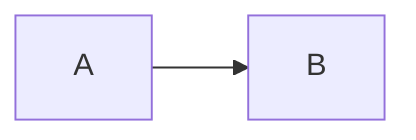

This documentation site is a workspace package under `docs/`. It is a
**living document**: when the platform changes, the docs must follow. This
guide defines when a change requires a docs update and how to do it.

## The principle

Review the docs **before committing changes that affect documented systems or
plans** — and update any relevant file. Only update docs when the changes
actually touch what is documented. A lesson-content edit that does not alter
the lesson→episode mapping, for instance, does not need a docs update.

## When to update the docs site

| Platform change | Docs page(s) affected |
| --- | --- |
| New section | [Project Structure](/architecture/project-structure), [Data Model](/architecture/data-model), [Add a Section](/content/add-section) |
| New month/part | [Data Model](/architecture/data-model), [Add a Month](/content/add-month) |
| New lesson type / slot change | [Rendering](/architecture/rendering), [Add a Lesson](/content/add-lesson) |
| New component or hydration change | [Components Overview](/components/overview) + the component page |
| Storage/state change | [Client State](/architecture/client-state) |
| Config/scripts/build change | [Build System](/architecture/build-system), [Scripts Reference](/development/scripts) |
| CI/deploy change | [CI/CD](/development/ci-cd), [Deployment](/development/deployment) |
| Verification change | [Verification](/development/verification) |
| Lint rules change | [Lint & Format](/development/lint-format) |
| New workflow for authors | A new page under [Guides](/guides/enrich-lesson) |

When in doubt, ask: would someone reading the docs benefit from knowing about
this change? If yes, update it.

## How to update

### 1. Edit the page

Pages live in `docs/src/content/docs/<section>/<page>.md`. Use the frontmatter
contract:

```md
---
title: Page Title
description: Short summary shown in search and cards.
---
```

and the components/utilities available in Starlight (admonitions `:::note`,
`:::tip`, `:::caution`, `:::danger`, cards, tabs, and Mermaid diagrams):

````md
:::note
A note worth remembering.
:::


````

### 2. Add or remove sidebar entries

If you add a new page, register it in the sidebar in `docs/astro.config.mjs`
under the right group:

```js
{
  label: "Guides & Tutorials",
  items: [
    { label: "Enrich a Lesson", slug: "guides/enrich-lesson" },
    // …
  ],
},
```

The `slug` is the path under `docs/src/content/docs/` without the extension
and without a leading slash.

:::caution
The Starlight **build fails** if a sidebar `slug` doesn't exist — keep the
sidebar and the files in sync.
:::

### 3. Build and preview

```bash
pnpm docs:build     # builds docs/dist
pnpm docs:preview   # serve at :4322
```

For live editing use `pnpm docs:dev` (port 4322).

### 4. Document the docs change

The docs site itself is part of the repository, so its changes go through the
normal loop:

- `CHANGELOG.md`: `### Documentation` — "Added/Updated docs page X".
- `README.md`: update if the change merits a mention.
- Commit on a feature branch.

## The legacy docs

The three markdown files at `docs/` root are **also** part of the docs
ecosystem: `content-audit.md`, `s2-2022-mentorship-plan.md`,
`s2-2022-mentorship-videos.md`. Update those when the corresponding plans
change — and cross-link them from the docs site via
[Legacy Project Docs](/reference/legacy-docs).
